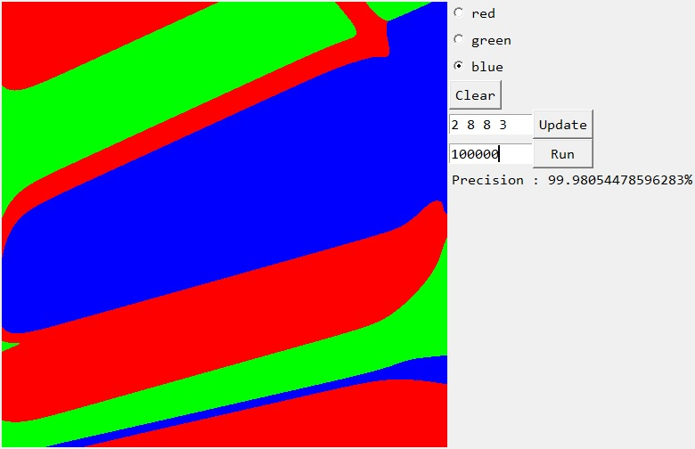
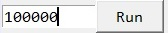

# Python-Neural-Network-Shapes

This is a program that served as a test for a neural network module that I coded.

It fills the image with 3 different colors depending on the points you have placed before.
## Features
- Possibility to set the structure of the neural network
- Possibility to set the number of trainings that the network will have
- Network accuracy display
## Installation
1. Download the repository by clicking on `Code > Download ZIP`
2. Extract the ZIP file
3. Run `main.pyw`
## Requirements
- Python 3.7
- Python `tkinter` library
- Python `PIL` library
- Python `math` library
## Usage
You can set the number of nodes for each network layer using this section :

Warning ! The first number has to be `2` and the last has to be `3`.

Here you can specify the number of trainings the network will have and then click on `Run` to launch to program.

